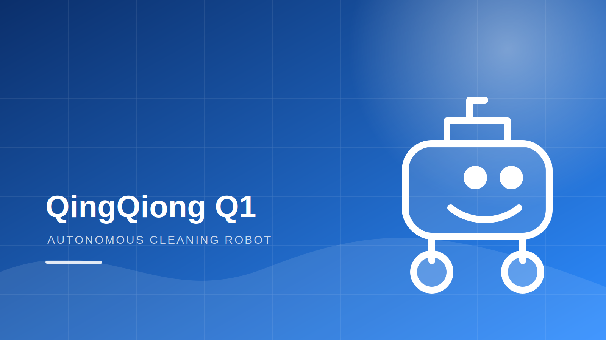

# Eason-Yeager 个人学术主页（蓝白经典学术版）

这一版按照传统 Academic Homepage 的结构制作：

- 无导航栏
- 顶部为“左侧个人信息 + 中间照片 + 右侧个人标识”
- 下方依次为 Biography、News、Education、Representative Projects、Honors & Awards
- 蓝白色系、衬线字体、轻量动画
- 支持电脑和手机
- 可直接部署到 GitHub Pages

## 1. 最快部署方法

1. 在 GitHub 创建公开仓库：`Eason-Yeager.github.io`
2. 将本文件夹里的所有文件上传到仓库根目录
3. 进入仓库 `Settings → Pages`
4. 设置：
   - Source：Deploy from a branch
   - Branch：main
   - Folder：/(root)
5. 等待发布后访问：`https://Eason-Yeager.github.io`

注意：`index.html` 必须直接位于仓库根目录，不能再套一层文件夹。

## 2. 替换个人照片

1. 准备 JPG 或 PNG 照片，建议为正方形或接近正方形。
2. 重命名为 `avatar.jpg`。
3. 放进 `assets/` 文件夹。
4. 打开 `index.html`，找到：

```html

```

改为：

```html

```

## 3. 修改个人信息

全部个人文字都在 `index.html` 中，并已用中文注释标出。

需要重点修改：

- 姓名
- 身份与学校
- Email
- Biography
- News
- Projects
- Honors

搜索现有文字即可快速定位，例如搜索：

```text
replace-with-your-email
```

替换成真实邮箱。

## 4. 修改个人标识

右侧标识文件是：

```text
assets/yichen-logo.svg
```

可以继续使用，也可以用自己的 PNG/SVG 替换，然后修改 `index.html` 中的图片路径。

## 5. 替换项目图片

将项目图片放入 `assets/`，例如：

```text
assets/qingqiong.jpg
```

然后把：

```html

```

改成：

```html

```

建议图片使用 16:9 比例，例如 1600×900 或 1280×720。

## 6. 添加项目链接

项目中暂时无链接的位置写的是：

```html
<a href="#">GitHub</a>
```

这类按钮会被 CSS 自动隐藏。获得真实链接后改成：

```html
<a href="https://github.com/Eason-Yeager/仓库名" target="_blank" rel="noopener">GitHub</a>
```

## 7. 添加简历

1. 将 PDF 重命名为 `cv.pdf`
2. 放到 `docs/cv.pdf`
3. 在 `index.html` 中找到：

```html
<a class="hidden cv-link" href="docs/cv.pdf" ...>CV</a>
```

删除 `hidden`：

```html
<a class="cv-link" href="docs/cv.pdf" ...>CV</a>
```

## 8. 本地预览

推荐使用 VS Code 的 Live Server：

1. 安装 Live Server 扩展
2. 右键 `index.html`
3. 选择 `Open with Live Server`

也可以直接双击 `index.html` 查看。

## 9. 文件说明

```text
index.html   页面内容与结构
styles.css  蓝白色样式和手机端适配
script.js   年份更新与淡入动画
assets/     头像、Logo、学校标识、项目图片
docs/       简历 PDF
```
